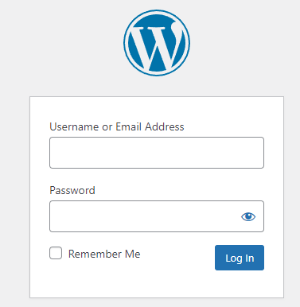
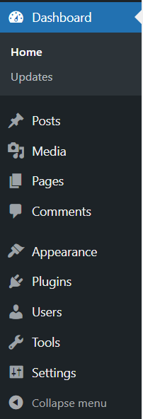
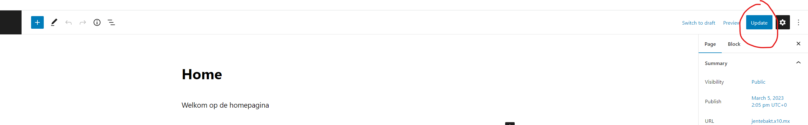

# How To Use Jente Bakt

Welkom bij de uitleg van de website van Jente Bakt.

Op de website staan accounts die speciaal gecreëerd zijn om aanpassingen te doen aan de website. Om aan te melden ga je naar de url: [https://jentebakt.x10.mx/wp-admin](https://jentebakt.x10.mx/wp-admin). Daar kan je je aanmelden met de juiste gegevens.



## Onderdelen

**Navigatie Menu:** 


## Pagina's Wijzigen

### Creëren en updaten

Ga via het navigatie menu naar `Pages`. Je krijgt een pagina te zien van al de huidige pagina's. Hier kan je er een toevoegen of verwijderen of aanpassen. Klik simpelweg op de naam van de pagina en hier kan je doen wat je wil.

Wanneer je aanpassingen aan de pagina's hebt gedaan moet je niet vergeten om op `Update` te klikken in de rechterbovenhoek.




### Pagina links maken

Om te kunnen navigeren naar een pagina moet er  een zichtbare link worden gemaakt. Dit doe je door eerst naar `Appearance > Menus` te gaan. Daar heb je de keuze om 2 menu's aan te passen. Kies waar je de link erbij wil zetten (links of rechts) en selecteer deze in de bovenste dropdown. Het scherm zal onderaan veranderen.

#### Icoontjes Toevoegen

Het is ook mogelijk om iconen toe te voegen aan de navigatie. Ga eerst naar [Google Icons](https://fonts.google.com/icons?icon.style=Rounded), daar kan je kiezen tussen al de rounded icon styles. Klik op een icoon en kopieer de `Inserting the icon` code. Plak deze daarna onder het juiste `Navigation Label` op het Jente Bakt Panel, door eerst de juiste pagina open te klikken. Als je het icoon toevoegt aan de navigatie balk vergeet dan niet `nav-icon` toe te voegen onder het `class=""` veld. Dit ziet er dan als volgt uit:

```html
<span class="material-symbols-rounded nav-icon">
shopping_cart
</span>
```

Sla opnieuw het menu op om de wijzigingen zichtbaar te maken.

## Producten Wijzigen

### Creëren en updaten

Navigeer eerst naar `Posts` om dit te kunnen wijzigen.

Een product toevoegen doe je op dezelfde manier als een pagina toevoegen. Er zijn wel nog enkele speciale dingen die anders zijn, hieronder een overzicht.

|      Naam      |      Locatie      | Beschrijving                                                 |
| :------------: | :---------------: | ------------------------------------------------------------ |
|      Tags      | Rechter Navigatie | Tags die te maken hebben met het product. Hier kan de gebruiker er daarna op navigeren. |
| Featured Image | Rechter Navigatie | Een afbeelding dat zichtbaar is voor de gebruiker. Indien dit niet wordt toegevoegd voor een product zal dit er minder mooi uitzien. |
|    Excerpt     | Rechter Navigatie | Een korte beschrijving die zichtbaar zal zijn op het het product overzicht. Dit wordt automatisch gegenereerd indien dit niet is ingevuld. |
|     price      |   Custom Fields   | De prijs van het product. Zie hieronder voor het formaat.    |
|      min       |   Custom Fields   | Het minimum aantal producten dat de klant kan bestellen.     |
|      step      |   Custom Fields   | Per hoeveel het aantal omhoog gaat voor de klant. Bij step = 6 en minimum = 6: 6 -> 12 -> 18 -> 24 ... |

***Custom Fields***: Deze maak je zichtbaar via de 3 puntjes in de rechterbovenhoek. Klik daarna op `Preferences` > `Panels` > `Additional` > `Custom Fields.

***Price Format***: aantal_producten:prijs|volgende_optie_aantal_producten:volgende_optie_prijs

vb: 6 cupcakes voor 12 euro. Daarna 12 cupcakes voor 20 euro. **6:12|12:20** 

## Extra Customisations

Om de footer van de website te wijzigen ga je naar `Appearance` > `Widgets` daar kun je de tekst zetten dat je wil. Vergeet niet te updaten.

Ook het email-adres kan geüpdatet worden via hier. Dit moet als type `Custom HTML` zijn voordat dit kan werken.